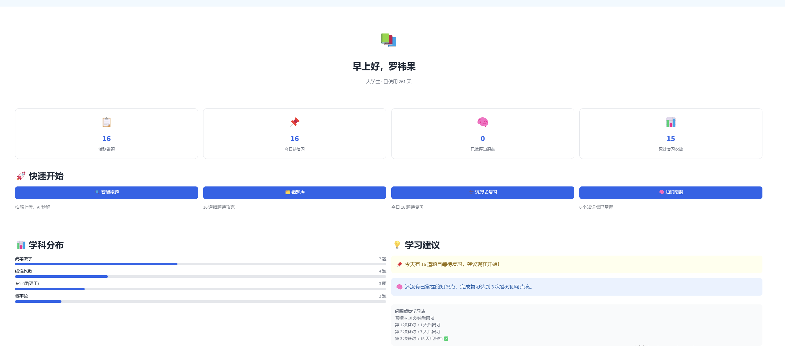
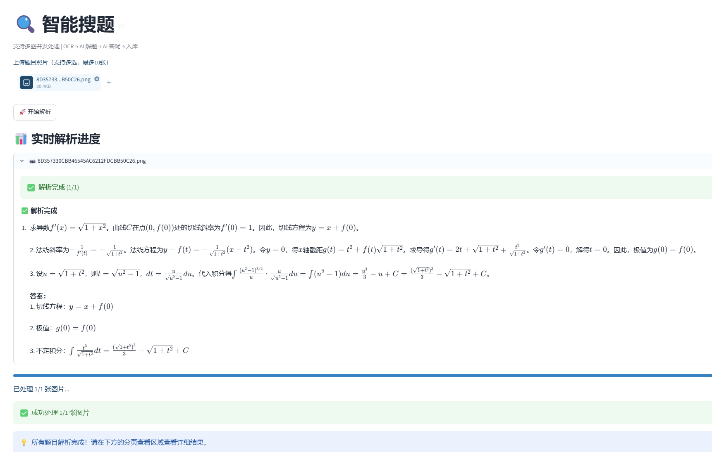
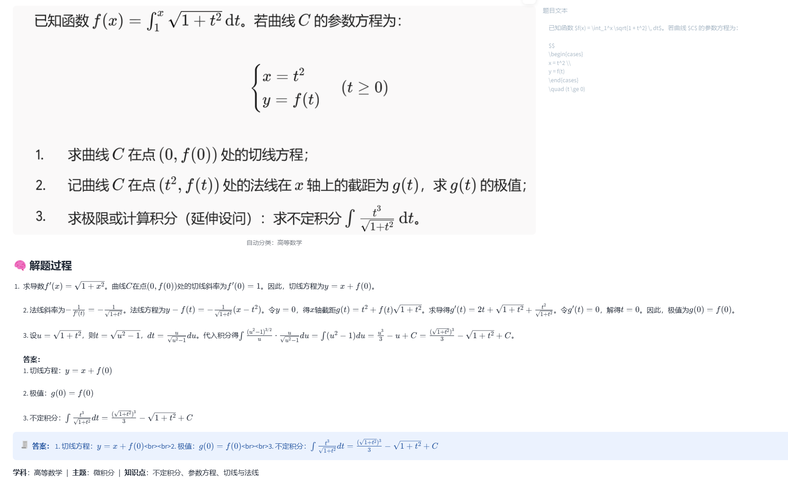
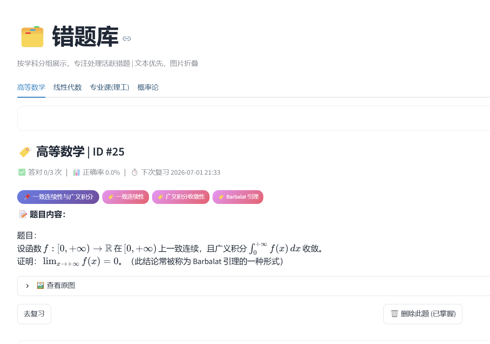
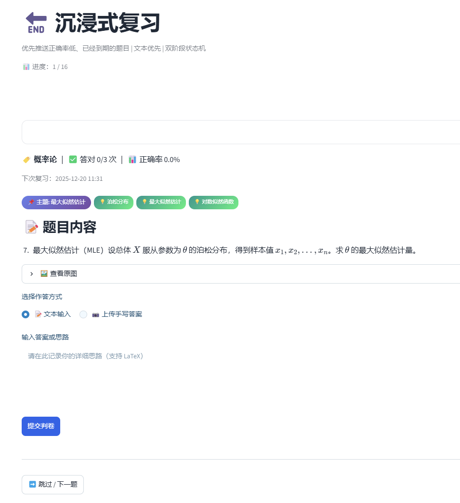
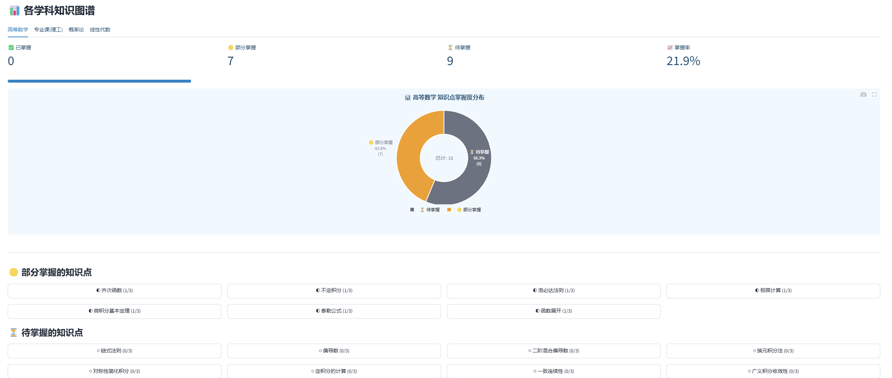
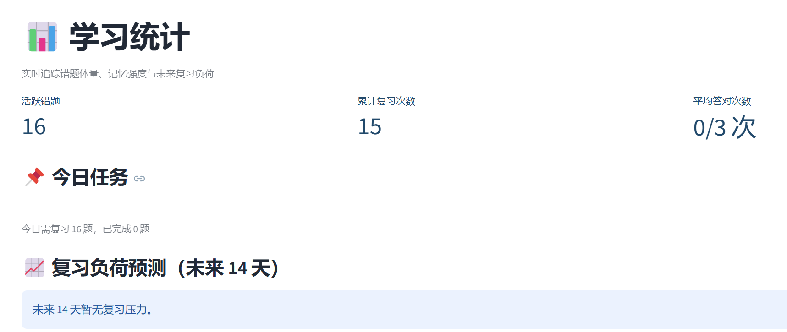

# DeepPrep 智能备考平台

> 拍照搜题、错题管理与间隔复习的一站式 AI 备考工具。

[](https://streamlit.io)
[](https://python.org)

**线上体验**：https://deepprep.streamlit.app

**演示账号**：`罗祎果` / `123456`（已预置 20 道错题，涵盖高等数学、线性代数、专业课、大学英语）

---

## 要解决的问题

备考过程中常见三个问题：

1. **错题整理成本高** — 手抄错题费时费力，抄完往往不再翻阅
2. **复习缺乏计划** — 不知道该复习什么、何时复习
3. **薄弱点不清晰** — 错题分散，难以定位自己最薄弱的学科与知识点

DeepPrep 将这三个问题串成一个闭环：**搜题 → 理解 → 复习 → 掌握**。

---

## 核心功能

系统包含 6 个一级模块：

| 模块 | 说明 |
|------|------|
| 🏠 **首页** | 学习概览（活跃错题、今日待复习、已掌握知识点）+ 快捷入口 |
| 🔍 **智能搜题** | 拍照或文本上传，AI 识别文字并逐步解析，流式显示解题过程 |
| 🗂️ **错题库** | 按学科分组，文本优先 + 图片折叠，知识标签一目了然 |
| 🔄 **沉浸式复习** | 间隔重复算法推送 + AI 判卷 + AI 答疑，复习中可一键生成同类题 |
| 🧠 **知识图谱** | 知识点掌握度可视化，点击查看关联错题 |
| 📊 **学习统计** | 活跃错题、累计复习、未来复习负荷预测 |

> 同类题生成是「沉浸式复习」中的一个功能，并非独立模块：复习时按原题知识点生成变式题，结果不写入错题库。

### AI 能力

- **OCR 文字识别**：拍照上传，识别题目文字与图片内容
- **AI 逐步解题**：按题型自适应解析（数学推导 / 英语拆词 / 代码推演），流式输出
- **AI 判卷**：复习时自动批改作答，采用保守策略（不确定时默认判错）
- **AI 答疑**：对解析有疑问可追问，支持上下文连续对话
- **同类题生成**：复习时按原题知识点生成变式题

### 产品闭环

```
拍题上传 → AI 识别 + 解题 → 保存错题 → 间隔重复复习 → AI 判卷 → 知识点追踪
    ↑                                                                     │
    └──────────────────── 同类题巩固 ←─────────────────────────────────────┘
```

---

## 核心页面展示

### 🏠 



### 🔍 





### 🗂️ 



### 🔄 



### 🧠 



### 📊 



---

## 技术栈

- **应用框架**：Streamlit（Python 一体化框架，前后端不分离）
- **数据库**：SQLite（轻量、零配置，多用户数据隔离）
- **AI**：SiliconFlow API（OCR 用 Qwen3-VL-32B，解题/判卷/答疑用 Qwen2.5-32B，接口兼容 OpenAI SDK）
- **可视化**：Plotly（交互式图表）
- **部署**：Streamlit Cloud（关联 GitHub，自动部署）

---

## 本地运行

```bash
# 1. 克隆
git clone https://github.com/dangbichanh71-ctrl/DeepPrep.git
cd DeepPrep

# 2. 安装依赖
pip install -r requirements.txt

# 3. 配置 API Key（复制 .env.example 为 .env 并填入）
# SILICONFLOW_API_KEY=你的Key

# 4. 启动
streamlit run app.py
```

浏览器打开 `http://localhost:8501`，用演示账号 `罗祎果 / 123456` 登录即可体验完整流程。

---

## 产品文档

以下文档记录了产品的设计思路与决策过程：

- 📋 [产品需求文档 (PRD)](docs/PRD.md) — 痛点分析、功能优先级、指标体系
- 👥 [用户故事地图](docs/USER_STORIES.md) — 用户画像与核心旅程
- 🔍 [竞品分析](docs/COMPETITIVE_ANALYSIS.md) — 与作业帮、Anki、猿题库的对比

---

## 作者

DeepPrep 由湖南工商大学人工智能专业学生独立设计并实现，面向从中学到大学的学生备考场景，探索 AI 在拍照搜题、错题管理与个性化复习中的应用。

欢迎反馈与建议，如遇问题欢迎提 Issue。
